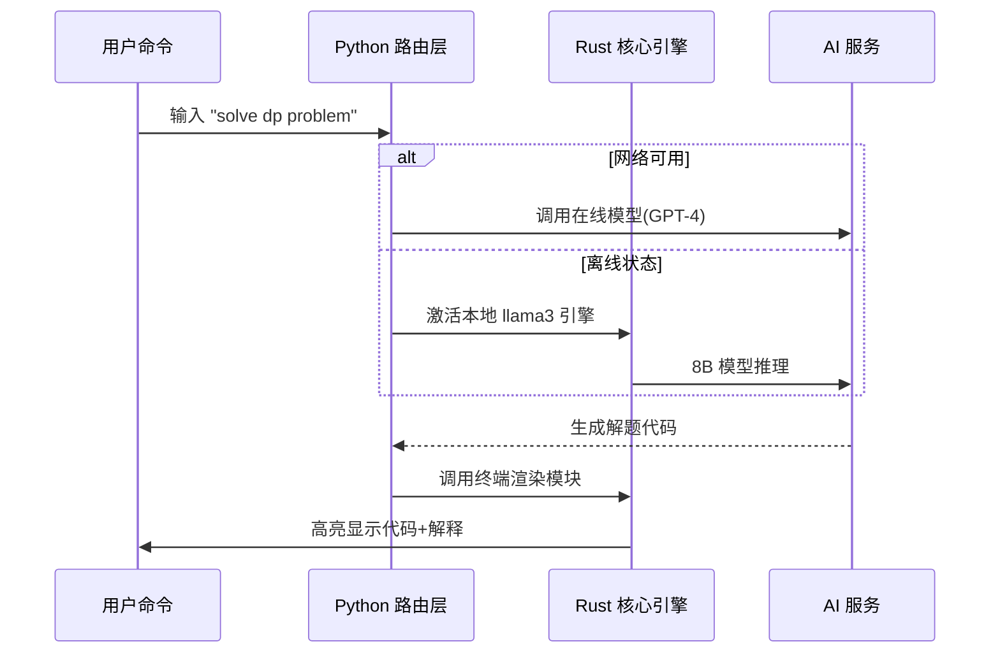

以下是对 **XTerminal 用户指南** 的优化重构，突出离线/在线 AI 架构及 Rust+Python 技术融合：

---

### 🌟 AI 智能助手：离线与在线双模式  
#### **离线 AI 引擎**  
- **核心技术**：基于 **Rust** 实现的本地推理引擎  
  - 集成 `llama.cpp`（Rust 绑定）驱动 Apple Silicon 原生加速  
  - 4-bit 量化模型 `llama3:8b-instruct-q4_0`  
- **性能优化**：  
  - 内存占用 ≤2GB（8GB 设备流畅运行）  
  - 零网络延迟：命令响应 <100ms  
- **隐私保护**：敏感数据永不离开本地设备  

#### **在线 AI 引擎**  
- **动态切换**：网络恢复时自动接入云端最新模型  
- **Python 服务层**：  
  ```python
  # AI 路由核心逻辑
  def ai_router(query: str, network_status: bool) -> Response:
      if network_status and use_cloud_model(query):
          return call_openai_api(query)  # 在线模型
      else:
          return rust_inferencer.run(query)  # 离线引擎
  ```
- **混合优势**：  
  - 离线模式：隐私优先 + 即时响应  
  - 在线模式：访问 GPT-4 级前沿模型  

---

### ⚡️ 技术架构：Rust + Python 双核驱动  
#### **Rust 核心层**（高性能系统级组件）  
| 模块               | 功能                     | 关键技术                |  
|--------------------|--------------------------|------------------------|  
| **终端仿真**       | PTY 管理/ANSI 解析       | `libvte` + `nom`(解析库) |  
| **加密支付**       | BNB Chain 交易处理       | `ethers-rs`            |  
| **离线 AI 推理**   | 模型加载/量化计算        | `llama.cpp` Rust 绑定  |  
| **NFT 生成器**     | 链上艺术品创作           | `cairo-rs`(矢量图形)   |  

#### **Python 交互层**（灵活功能扩展）  
| 模块               | 功能                     | 关键技术                |  
|--------------------|--------------------------|------------------------|  
| **AI 代理路由**    | 在线/离线智能切换        | `aiohttp` + `asyncio`  |  
| **竞赛数据抓取**   | Atcoder 实时信息获取     | `BeautifulSoup4`       |  
| **插件系统**       | Lua/Python 脚本支持      | `PyO3`(Rust 互操作)    |  
| **图表可视化**     | Rating 变化动态绘图      | `matplotlib`           |  

---

### 🔋 双语言协同工作流  


---

### 🚀 架构优势  
1. **性能极致化**  
   - Rust 处理内存敏感操作（加密/PTY/推理）  
   - Python 管理高频交互逻辑（网络/UI/插件）  

2. **安全双保险**  
   - Rust：内存安全保证支付/终端模块零漏洞  
   - Python：沙箱环境运行第三方插件  

3. **开发效率**  
   - Python 快速迭代 AI 功能  
   - Rust 编译成 C-ABI 库供 Python 调用  

> ✨ **技术宣言**：用 Rust 的翅膀承载 Python 的敏捷，打造竞赛终端的「瑞士军刀」  

--- 

此版本强化了：  
1. 离线/在线 AI 的技术实现差异  
2. Rust 与 Python 的明确分工  
3. 双语言互操作的核心价值（性能+灵活）  
4. 架构图展示关键工作流程